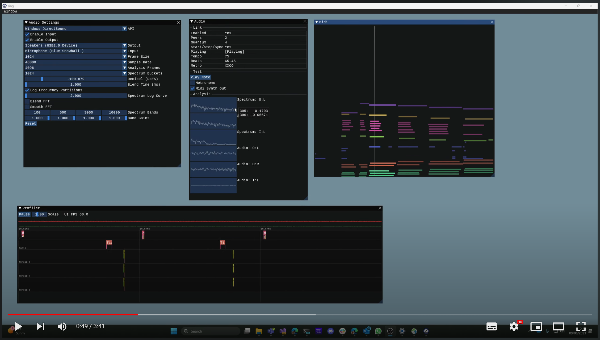
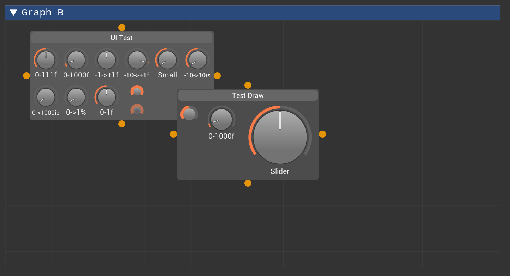

[Zing](https://github.com/Rezonality/zing) - A Simple Audio Integration Library
===================================================================================================
[](https://github.com/Rezonality/zing/actions?query=workflow%3ABuilds)
[](https://github.com/Rezonality/zing/blob/master/LICENSE)

Zing is an audio integration library designed to get ImGui Apps up and running with audio I/O.  It builds cross platform, but has so far only been tested on windows.  It's a grab-bag of useful stuff to get you started in audio.  The code is simple C++.  It needs a helper library submodule containing some useful c++ stuff, and some packages.  You can probably drop this code into your app and start playing; mostly it is structs and functions.  The built in profiler is useful for seeing where your time is spent; I find it invaluable for threading situations.  For the best introduction, see the short video overview below.

The demo lets you tweak parameters and generates a tone sound using the soundpipe library, in addition to the metronome that Ableton link provides (assuming you have sound output enabled).  It reads in a simple midi stream and plays it back using the tsf midi renderer library (the midi messages are streamed to the audio pipeline using a concurrent queue).

- Configuration UI for the audio, using the Port Audio library.
- FFT analysis of the incoming audio in seperate threads, and simple display of the spectrum and audio waveform.
- Ableton Link integration, for sharing tempo with other applications.
- Integrates Soundpipe for simple effect/audio processing modules.
- Simple thread profiler so you can see live what the UI and audio threads are doing.
- Basic MIDI data visualization.
- Save/Load of all settings to a TOML file.
- Management of the audio device using port audio.
- Load of Midi and playback

## Video Overview
[](https://youtu.be/wCY025pFJAo "Zing Overview")

## Screenshot


## Building
``` bash
git pull
git submodule update --init --recursive
prebuild.bat OR prebuild.sh
config.bat OR config.sh
build.bat OR build.sh
```

## Libraries Used

See prebuilt.bat for the full list

### Sound
[SoundPipe](https://github.com/shybyte/soundpipe)

[PortAudio](https://github.com/PortAudio/portaudio)

[EarLevel](https://www.earlevel.com/main/2012/05/03/a-wavetable-oscillator�introduction)

[Ableton Link](https://github.com/Ableton/link)

### Other
[ImGui](https://github.com/ocornut/imgui)

[Concurrent Queue](https://github.com/ikiller1/moodycamel-ConcurrentQueue)

[TomlPlusPlus](https://github.com/marzer/tomlplusplus)

